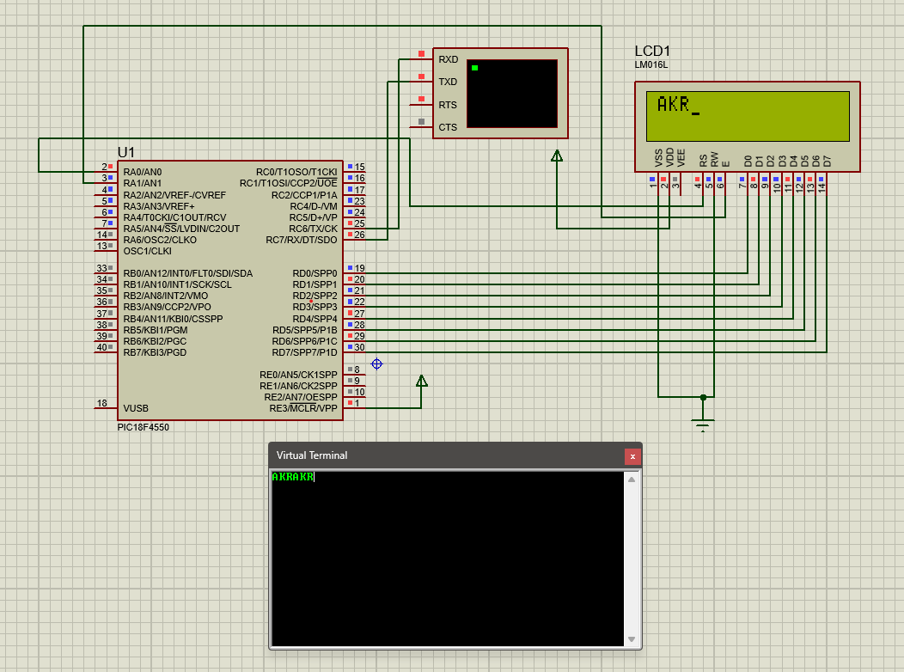

# USART-LCD
This project demonstrates how to receive characters through the USART module of a PIC18F4550 microcontroller and display them on a 16x2 LCD, while simultaneously echoing the received characters back to the sender.

# 📄 PIC Microcontroller USART to LCD Project

## 💡 Overview

This project demonstrates how to receive characters through the USART module of a PIC18F4550 microcontroller and display them on a 16x2 LCD, while simultaneously echoing the received characters back to the sender.

---

## ⚙️ Hardware Requirements

- **Microcontroller**: PIC18F4550
- **Display**: 16x2 LCD (e.g., LM016L)
- **Virtual Terminal**: For serial communication simulation (e.g., Proteus virtual terminal)
- **Connections**:
  - LCD data lines: PORTD
  - LCD control lines: RA0 (RS) and RA1 (EN)
  - USART TX/RX pins connected to virtual terminal

---

## 💻 Software Requirements

- Compiler: MPLAB XC8 or any compatible C compiler for PIC
- Proteus Design Suite (or any other simulator for verification)

---

## 🔌 Circuit Description

- LCD is configured in 8-bit mode and controlled through PORTD, with RS and EN signals on RA0 and RA1.
- The USART module is configured for asynchronous communication at 9600 baud rate.
- Characters received over USART are shown on the LCD and echoed back to the sender.

---

## 💬 Code Explanation

```c
#include <xc.h>

void command(int cmd);
void data(int data);
void delay();
void trans(char c);
char rec();

void delay() {
    // Simple software delay
    int i, j;
    for (i = 0; i < 500; i++) {
        for (j = 0; j < 500; j++) {
        }
    }
}

void command(int cmd) {
    LATD = cmd; // Send command to data lines
    RA0 = 0;    // RS = 0 for command
    RA1 = 1;    // Enable high
    delay();
    RA1 = 0;    // Enable low
}

void data(int data) {
    LATD = data; // Send data to data lines
    RA0 = 1;     // RS = 1 for data
    RA1 = 1;     // Enable high
    delay();
    RA1 = 0;     // Enable low
}

void trans(char c) {
    TXREG = c;      // Load character into TX register
    while (TXIF == 0); // Wait until transmission complete
    TXIF = 0;
}

char rec() {
    while (RCIF == 0); // Wait for data reception
    return RCREG;      // Return received character
}

void main(void) {
    TRISC = 0x80;  // RC7 (RX) input, RC6 (TX) output
    TXSTA = 0x24;  // Enable TX, asynchronous mode, high speed
    RCSTA = 0x90;  // Enable serial port, continuous receive
    SPBRG = 129;   // Baud rate 9600 for 20MHz clock

    TRISD = 0x00;  // LCD data port as output
    TRISA = 0x00;  // Control pins as output
    ADCON1 = 0x0F; // Configure pins as digital

    delay();

    // LCD initialization
    command(0x38); // 8-bit mode
    command(0x80); // Set cursor at first line
    command(0x06); // Increment cursor
    command(0x0E); // Display ON, cursor ON
    command(0x01); // Clear display

    char a;
    while (1) {
        a = rec();  // Receive a character
        data(a);    // Display on LCD
        trans(a);   // Echo back
    }
}

```
## 📝 Code Explanation
- `command()`: Sends an LCD command (e.g., clear display, set cursor).
- `data()`: Sends a character to display on LCD.
- `trans()`: Sends (transmits) a character over USART.
- `rec()`: Receives a character from USART.
- `delay()`: Creates approximate delay for LCD timing.

## 🛠️ Steps to Do
- Write the code in MPLAB X IDE or your preferred editor.
- Compile the code using XC8 to generate a HEX file.
- Connect the circuit as shown in usart-lcd.png.
- Load the HEX file into Proteus or flash to the physical PIC.
- Open the virtual terminal and start typing — each character will display on LCD and echo back in terminal.

## ⚡ USART Configuration
- **Baud rate**: 9600
- **Mode**: Asynchronous
- **Transmission and reception**: Enabled

## 🖼️ Schematic


## ⚠️ Limitations
- Blocking receive — no interrupt used.
- Only one character handled at a time.
- Software delay is approximate.

## 📄 License
This project is shared for educational purposes only. Unauthorized reproduction or commercial use is prohibited.

## 🙏 Acknowledgments
Developed and tested on a PIC18F4550 development board and Proteus simulation.
